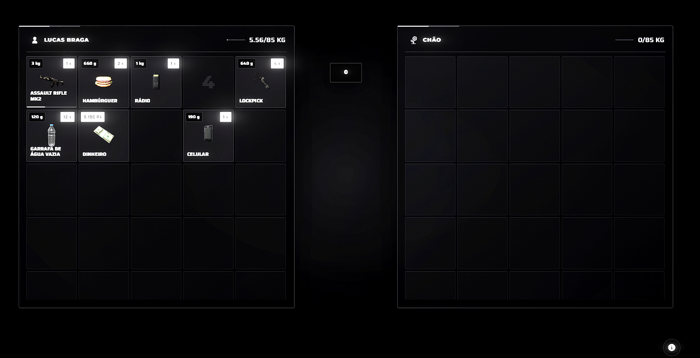

# Ox_inventory Redesigned

> Uma interface redesenhada e moderna para o **ox_inventory**, com foco em estética, organização e experiência do usuário.

---

## 📸 Preview

<div align="center">




</div>

---

## ✨ Características

- 🖤 Design moderno e minimalista
- 🎨 Interface totalmente redesenhada
- 📦 Mantém a estrutura do ox_inventory
- ⚡ Interface leve e responsiva
- 🖥️ Layout otimizado para diferentes resoluções
- 🎯 Melhor organização visual dos itens
- 🔘 Botões e elementos redesenhados
- 🌑 Tema Black
- ✨ Animações e efeitos visuais
- 🔧 Fácil personalização

---

## 🎨 Design

Mantém a funcionalidade e estrutura do `ox_inventory`, mas apresenta uma nova identidade visual.

O objetivo é oferecer uma interface:

- Moderna
- Elegante
- Minimalista
- Escura
- Organizada
- Compatível com diferentes estilos de HUD/UI

---

## 📦 Instalação

### 1. Faça um backup

Antes de instalar, faça um backup do seu `ox_inventory` original.

### 2. Instale o Novo "ox inventory" Redesenhado

Coloque os arquivos do projeto na estrutura correspondente do seu `ox_inventory`.

```text
resources/
└── [ox]/
    └── ox_inventory/
